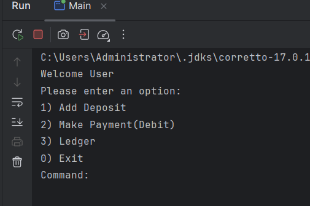
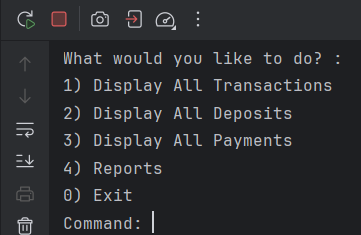
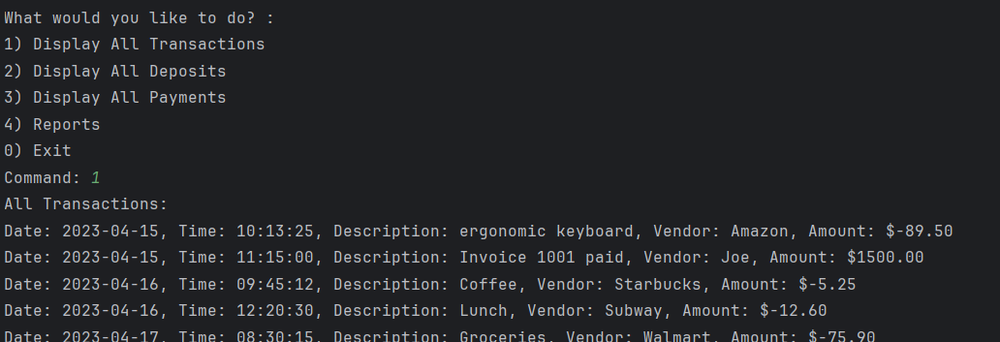
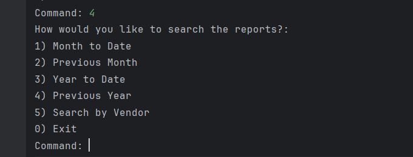
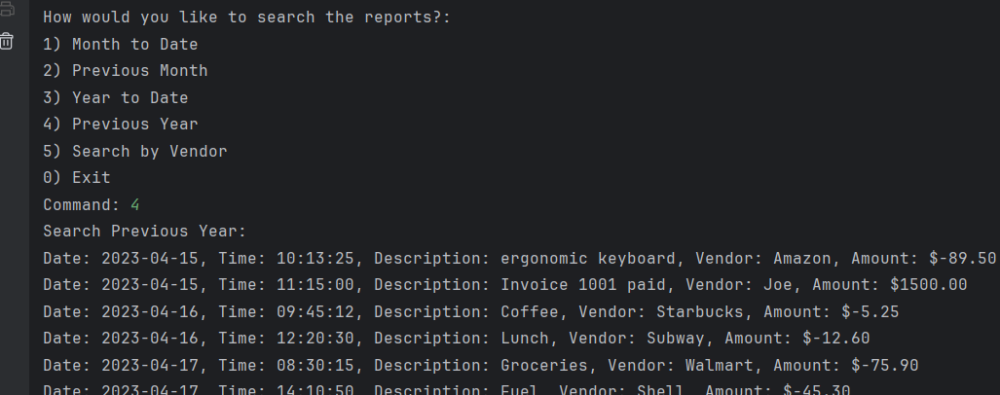

# Accounting Ledger 

## Overview

This is a Banking Ledger system that allows the user to create, record, and recall different transactions

## Features

- Create and Record Transactions
- Data Storage in Ledger
- Access Ledger 
- Sort Through Recorded Transactions with specific parameters
- Access and call reports based off dates and times
- Error Handling
- Expandable

## Aspects
- Main Class: Where user input is taken and executed
- Transaction Class: The structure in which all Transactions are stored
- transactions.csv: The area in which each Transaction is stored

## How it works

On boot the user is presented with the main menu

From here the user can pick one of four options:
- 1 Add a Deposit
- 2 Make a Payment
- 3 Go to the Ledger
- 0 Close Program

Options 1 & 2 will allow the user to write there repective transactions and store them to be called later
Option 0 is self-explanatory 
Option 3 takes you to a subMenu that interacts with the ledger

Within the Ledger your options are expanded to call on past Transactions
For example the First option displays all recorded transactions

The other options have similar functionality relative to how they are named

Option 4 on the other hand allows the user to load reports based of date of transactions

This is the final menu which will be the most specific and curated search/sort options  

## The Code Behind it

Behind these Menus are some very simple do/while loops that execute methods based of user selection
Every Menu follows the same structure of: 

'do {\
"switch statements accessing menu specific methods"\
} while { \
userInput.command != 0\
}'

followed by an error catch to allow the code to run smoothly

'try( ){\
}catch(Exception e){\
    e.printStackTrace();\
}'

Depending on the user input the program will do 1 of three things
- Access BufferReader/Writer Method
- Access next Menu
- Exit Current Menu (Or End Program if at Main Menu)